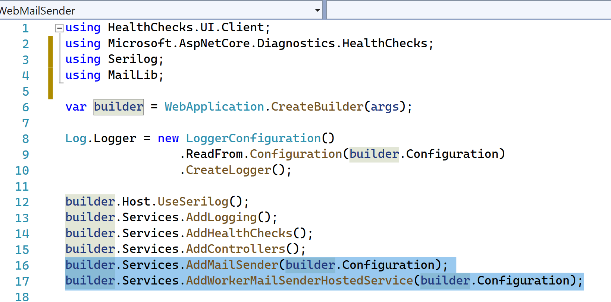

# MailLib & WebMailSender example




to use the library add `using MailLib` and inject the 2 services.

```csharp
using MailLib;

var builder = WebApplication.CreateBuilder(args);
...
builder.Services.AddMailSender(builder.Configuration);
builder.Services.AddWorkerMailSenderHostedService(builder.Configuration);

...
IOptions<MailSettings> mailSettings
EmailSender service
// in a controller
_service.SendEmails(_mailSettings, body);
```


EmailSender Service will help on sending e-mail like this `_service.SendEmails(_mailSettings, body);`

# How to Test sending e-mail

```bash 
## use curl or postman to send post to the sending method
# This will send an 3 e-mails referencing a random businessId of "5555" the template by convention has to be in ApplicationData/Templates/tenantId-templateId.html
# The MailLib will use ViewJson Data to find and replace placeholder using 'Stubble' library
# check https://mustache.github.io/mustache.5.html and https://github.com/StubbleOrg/Stubble/blob/master/docs/how-to.md

curl --location --request POST 'https://localhost:44305/api/messages' \
--header 'Content-Type: application/json' \
--data-raw '{
    "emailTemplateId": "email",
    "tenantId": "test",
    "businessId": "5555",
    "emails": [
        {
            "emailTo": "ycanu@test.com",
            "emailSubject": "This is a test {{testId}}"
        },
        {
            "emailTo": "ttoto2@test.com",
            "emailSubject": "This is a test {{testId}}"
        },
        {
            "emailTo": "ttoto3@test.com",
            "emailSubject": "This is a test {{testId}}"
        }
    ],
    "viewJson": {
        "testId": "dsfsdkfok kemowef",
        "arranger": {
            "me": "Yohann CANU"
        },
        "pickup": {
            "date": "2019-07-04T13:33:03.969Z"
        },
        "traveler": {
            "updated": true
        },
        "approval": {
            "approvalOfExpense": [
                { "name": "testExpense1"},
                { "name": "testExpense2"}
            ]
        }
    }
}'
```


## MailSettings

```json 
"MailSettings": {
    // sender = from email, tenant is not used at the moment, forceRecipient is used on demo server to test sending on smtp replacing real recipients with this list
    "MessageSettings": {
      "TenantId": "test",
      "Sender": "test.mgmt@test.com",
      "ForceRecipientForDemo": "test@test.com"
    },
    // configure connection to smtp
    "ServerConnection": {
      "SmtpPort": 1025,
      "SmtpServer": "test",
      "Timeout": 2000,
      "Debug": false,
      "NoSsl": true
    }
    // do not send e-mail will only save e-mails to disk
    // retry logic will retain e-mail for a maxNrDays and will retry for MaxFailure time
    "SendingLogic": {
    "DoNotSendEmail": true,
    "SaveEmail": true,
    "MaxNrDays": 10,
    "MaxFailures": 5
    }
  }
```

If SaveEmail --> email will be stored to `messages/sent`  or  `messages/notsent`  depending if an error occured on the batch

If SendingError --> email copy will be saved to `messages/notsent`

If DoNotSendEmail --> an event will be created on `events/notsent`

For retry logic `events/failures` and `events/sent` is used